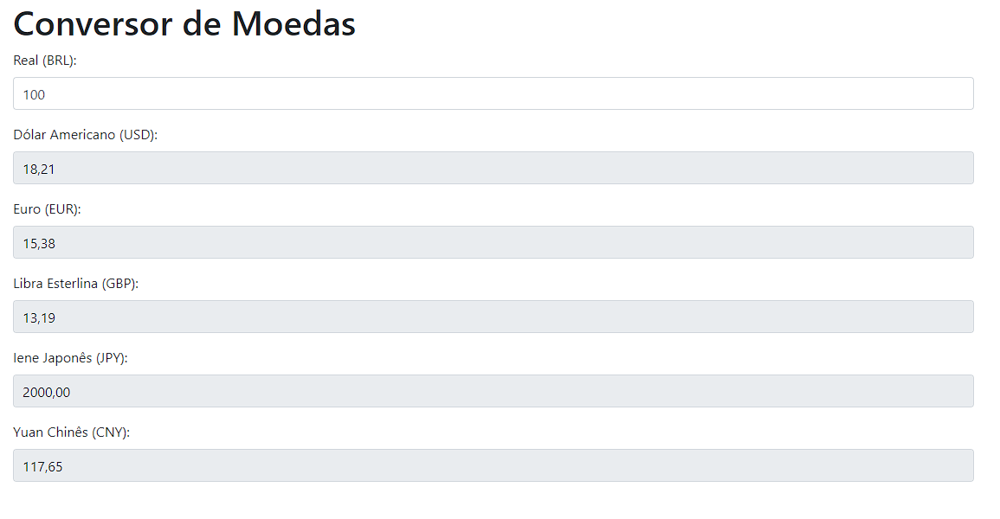

# Conversor de Moedas

## Descrição
O Conversor de Moedas é um projeto web que permite converter valores entre diferentes moedas. Este projeto foi desenvolvido como parte do meu aprendizado em desenvolvimento web.

## Funcionalidades Principais
- Conversão de valores entre diferentes moedas.
- Lista de moedas disponíveis para conversão.
- Atualização automática das taxas de câmbio.

## Tecnologias Utilizadas
- HTML5
- CSS3 (com pré-processador SASS/SCSS)
- JavaScript (possivelmente utilizando APIs para obtenção das taxas de câmbio)
- Bootstrap (opcional, dependendo da preferência e necessidade de um framework CSS)
- Git (para controle de versão)

## Como Utilizar
1. Clone o repositório (`git clone https://github.com/AngeloHervis/Conversor-de-Moedas.git`).
2. Abra o arquivo `index.html` em seu navegador web.
3. Selecione as moedas de origem e destino, insira o valor a ser convertido e clique no botão de conversão.

## Autor
Angelo Hervis
- GitHub: [AngeloHervis](https://github.com/AngeloHervis)
- LinkedIn: [Angelo Hervis](https://www.linkedin.com/in/angelohervis/)